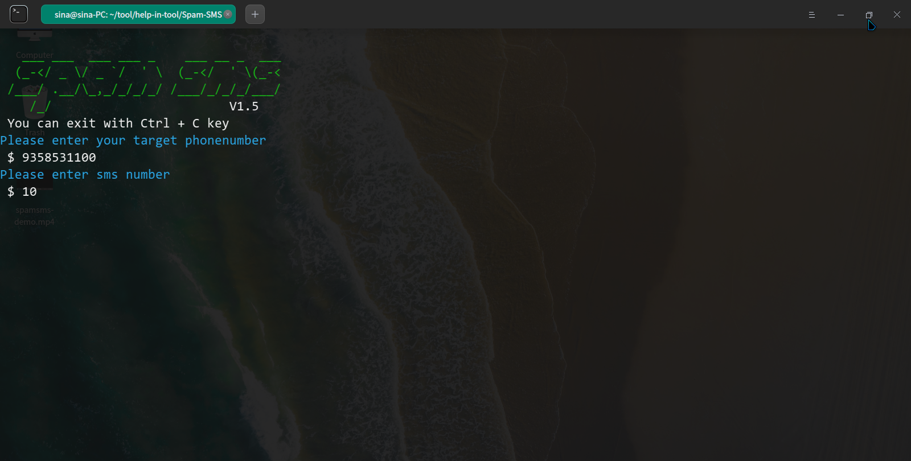

<h4 align="center">A Tool For Send Spam Sms With Python</h4>

<p align="center">
  <a href="http://python.org">
    
  </a>

  <a href="https://www.kali.org">
    
  </a>
  
  <a href="https://www.microsoft.com/de-de/">
    
  </a>
  
</p>



- **See demo video in demo folder.**

### Operating Systems Tested

- Windows
- Kali Linux 2021


### Installation On Kali Linux


```bash
git clone https://github.com/cymilad/Spam-SMS
cd Spam-SMS
pip3 install requests
python3 sms.py
```

### Contact us
- WebSite : https://cyberamooz.ir
- Channel Telegram : https://t.me/cyberamooz_ir
- Instagram : https://instagram.com/cyberamooz
- Contact With Me : https://t.me/cymilad

